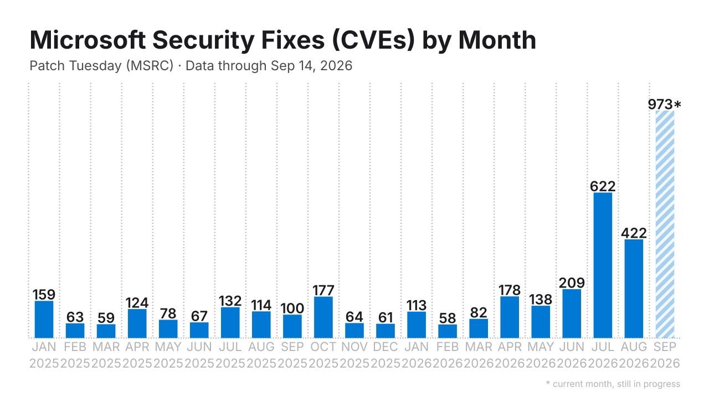
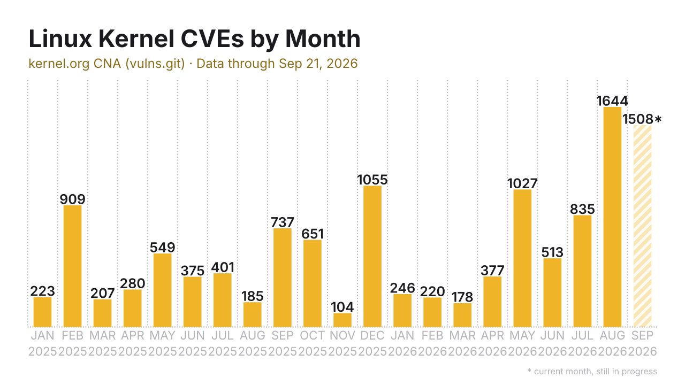
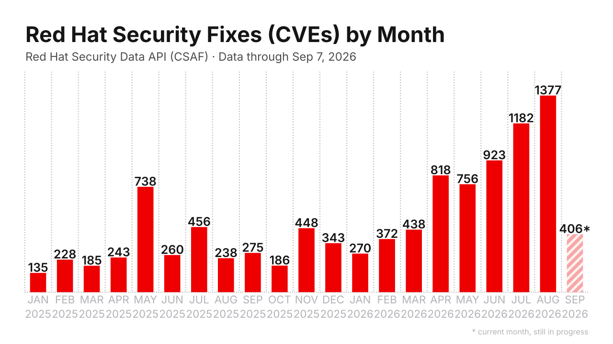
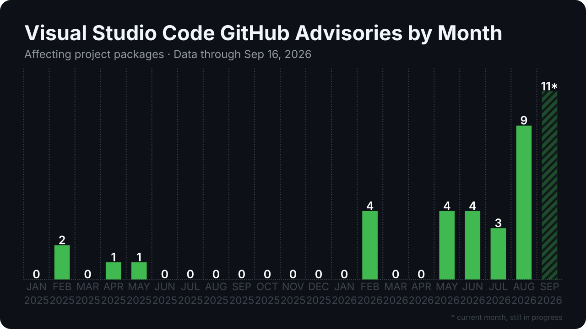
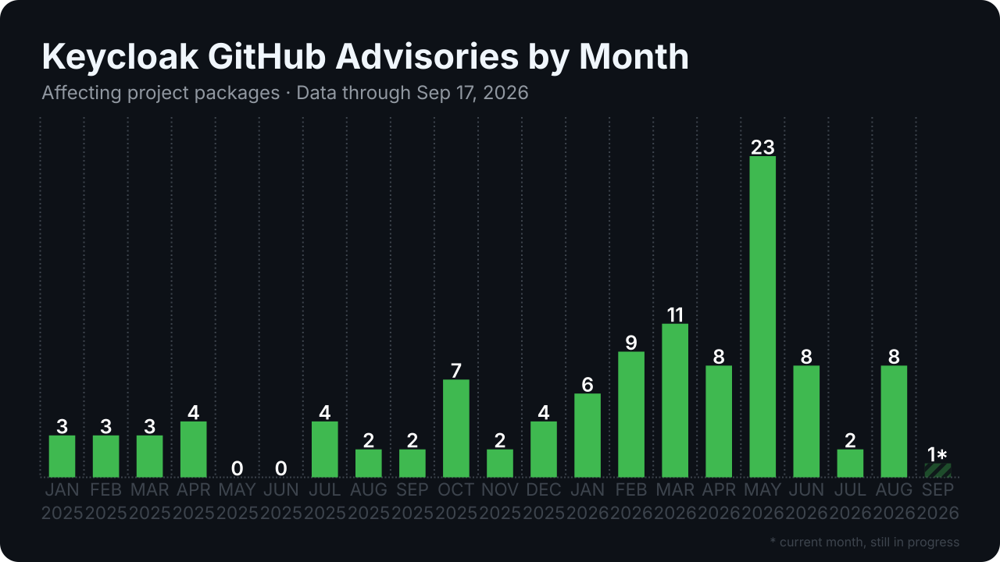

# Security Bug Fix Trackers

Monthly counts of publicly disclosed security fixes — for **Firefox** (Mozilla
MFSA), **Chrome** (Chrome Releases blog), **Microsoft** (MSRC Patch Tuesday),
the **Linux kernel** (kernel.org CNA), **Red Hat** (Security Data API), and
**GitHub reviewed advisories (GHSAs)** — plus a generic per-project GitHub
advisory tracker. Python 3.10+
standard library, plus **PyYAML** (`pip install pyyaml`) and — for the Firefox
and kernel trackers — `git` on PATH. Charts are SVG; data is TSV.

## Why this tracker

Firefox and Chrome are early adopters of cyber frontier models, and their
public fix streams are the most visible record of what those models do in
practice. Both vendors have documented the shift themselves: Mozilla in
[*Behind the Scenes Hardening Firefox*](https://hacks.mozilla.org/2026/05/behind-the-scenes-hardening-firefox/)
and Google in
[*Stronger with every update*](https://blog.google/security/chrome-stronger-with-every-update/).
Tracking how many security fixes they disclose each month turns that activity
into a measurable signal, helping answer two questions:

- **Is the wave behind us, or still going?** A sustained rise in monthly fixes
  suggests AI-assisted vulnerability discovery is still accelerating; a plateau
  suggests the first wave has passed.
- **Do newer models find bugs that previous ones missed?** When a new frontier
  model is released, Firefox and Chrome will probably get access to it. If fix
  counts climb again beyond what previous models produced, that suggests the
  newer model surfaces vulnerabilities its predecessors did not.

**Caveat:** models *find* vulnerabilities, but these charts only count the
ones that get **fixed**. A continuously high number therefore doesn't
necessarily mean vulnerabilities are still being discovered — it can also mean
these projects simply haven't had enough time to fix everything as fast as the
findings come in. High fix counts can reflect growing discovery *or* a fix
backlog growing faster than the teams can ship; the signal alone can't
separate the two.

**Note on the numbers:** our counts may differ slightly from the vendors' own
articles. Firefox is close but not exact: 424 unique bug IDs in April 2026
here vs. 423 fixes in Mozilla's write-up. Chrome differs by construction:
Google reports fixes per milestone (e.g. "1072 fixed in Chrome 149+150"),
while we bucket them by disclosure month — the common unit that keeps the
series comparable across projects. See [Methodology](#methodology) for the
exact counting rules.

The sections below maintain that record month by month, from public and
verifiable data.

---

## Firefox


Unique Bugzilla bug IDs disclosed in Mozilla Foundation Security Advisories
(desktop Firefox), per announcement month, since January 2025. Roughly 20
fixes/month through 2025, with a single large spike in April 2026 (424) and a
partial September 2026 (113, striped = month still in progress).

Source: [mozilla/foundation-security-advisories](https://github.com/mozilla/foundation-security-advisories).
Data: [`data/mozilla_mfsa.tsv`](data/mozilla_mfsa.tsv) — `month, total,
critical, high, moderate, low`.

## Chrome


Unique Chromium issue IDs disclosed as security fixes in Chrome Releases
stable-channel desktop posts, per disclosure month. Flat 2025 (8–34/month),
then the AI-era explosion: 95 → 124 → 370 (Mar–May 2026), peaking at **1,017
in June 2026** — more than all of 2025 combined.

Source: [Chrome Releases blog](https://chromereleases.googleblog.com/).
Data: [`data/chrome_monthly.tsv`](data/chrome_monthly.tsv) — `month, bug_count`.

## Microsoft



Unique CVEs fixed in each Microsoft Patch Tuesday release (MSRC Security
Update Guide), per release month since January 2025. The largest fix stream of
the four: 59–177 CVEs/month through 2025, then the same 2026 acceleration seen
elsewhere — 178 (Apr) → 209 (Jun) → **622 in July 2026**, the release the Zero
Day Initiative called the "bug apocalypse", easing to 422 in August. Microsoft
discloses online-service CVEs alongside product fixes; third-party CNA rows
mirrored into the guide (Chromium, GitHub, MITRE, ... — counted by the Chrome
and GHSA trackers here) are excluded.

Source: [MSRC Security Update Guide](https://msrc.microsoft.com/update-guide) (CVRF v3.0 API).
Data: [`data/msrc_monthly.tsv`](data/msrc_monthly.tsv) — `month, total,
critical, important, moderate, low, unknown`.

## Linux kernel



Unique CVEs published by the kernel.org CVE assignment team, per disclosure
month since January 2025 — the largest single fix stream tracked here
(~4.3k CVEs in 2024, ~5.7k in 2025). The program (started February 2024)
assigns a CVE to every merged stable-tree security fix and publishes in
bursts: 1,055 in December 2025 and 1,645 in August 2026, including batches of
older CVE ids cleared from the team's backlog. CVEs later rejected drop out
retroactively (current-state counting). No severity breakdown — the kernel
team deliberately does not score CVEs.

Source: [kernel.org CNA `vulns.git`](https://git.kernel.org/pub/scm/linux/security/vulns.git).
Data: [`data/kernel_monthly.tsv`](data/kernel_monthly.tsv) — `month, total`.

## Red Hat



Unique CVEs fixed by Red Hat security advisories (RHSAs; the occasional
CVE-carrying RHEA included), per initial release month since January 2025 —
tokenless via the Security Data API's CSAF list endpoint. 2025 ran at
135–738 CVEs/month; the pace then ramps up sharply through 2026 (July 1,182,
August 1,377), reflecting portfolio growth (AI/ML components such as vLLM
ship fixes in volume) and the same kernel-CNA stream the kernel tracker
charts. Revised advisories update in place and keep their initial month, so
revisions backdate into that month's counts; a CVE fixed by advisories in
several months counts in each (each is a distinct fix delivery). Severity is
the maximum advisory rating (Critical > Important > Moderate > Low).

Source: [Red Hat Security Data API](https://access.redhat.com/hydra/rest/securitydata/csaf.json).
Data: [`data/redhat_monthly.tsv`](data/redhat_monthly.tsv) — `month, total,
critical, important, moderate, low, unknown`.

## GitHub reviewed advisories (GHSA)


All GitHub-reviewed security advisories (reviewed CVE records in the GitHub
Advisory Database), per publication month. The pace accelerated from ~300/month
in 2025 to 1,500–1,700/month at the spring 2026 peak. Cumulative since
2025-01-01: 13,694 as of 2026-09-05 (snapshot log tracks the running total).

Source: [github.com/advisories](https://github.com/advisories).
Data: [`data/ghsa_monthly.tsv`](data/ghsa_monthly.tsv) — `month, ghsa`;
[`data/ghsa_counts.tsv`](data/ghsa_counts.tsv) — `snapshot_date, reviewed`.

## Per-project tracking

The GHSA tracker also scopes to any GitHub project: **affecting** = reviewed
package-database advisories matching the project's package names, unioned with
the GHSAs the project itself published (deduplicated by GHSA ID);
**published_by** = the advisories announced on the project's own security page.

### RabbitMQ


RabbitMQ: 95 affecting / 86 published-by as of 2026-09-05, with a large batch
in July 2026.

Source: [rabbitmq/rabbitmq-server security advisories](https://github.com/rabbitmq/rabbitmq-server/security/advisories).
Data: `data/rabbitmq_ghsa_{counts,monthly}.tsv` — columns
`affecting, published_by` (the `_published_chart.svg` variants chart the
published_by series).

### Visual Studio Code



VS Code: 54 affecting / 54 published-by as of 2026-09-11, all announced by the
`microsoft/vscode` repo on Patch Tuesdays. Flat through 2025 (2 in February,
1 each in April/May), then the 2026 ramp: 4 in February, 4 in May, 4 in June,
3 in July, 9 in August, 11 in September (partial). VS Code is not a
package-database package and its repo advisories are not in the GitHub Advisory
Database, so here `affecting` equals the repo-published stream and the
`_published_chart.svg` variant is the exact one.

Source: [microsoft/vscode security advisories](https://github.com/microsoft/vscode/security/advisories).
Data: `data/vscode_ghsa_{counts,monthly}.tsv` — columns
`affecting, published_by`.

### Keycloak



Keycloak: 82 affecting / 82 published-by as of 2026-09-11, all announced by the
`keycloak/keycloak` repo. 2025 was quiet (0–3/month, 16 total); 2026 clusters
into two batches — 8 in June and 7 in August — for 16 so far. A plain
`affects=keycloak` package query matches nothing, so without a token `affecting`
equals the repo-published stream and the `_published_chart.svg` variant is the
exact one; run with a token, the tracker also discovers the Maven package names
(`org.keycloak:keycloak-*`) and `affecting` picks up those package-database
matches too.

Source: [keycloak/keycloak security advisories](https://github.com/keycloak/keycloak/security/advisories).
Data: `data/keycloak_ghsa_{counts,monthly}.tsv` — columns
`affecting, published_by`.

## Methodology

| Tracker | Source | Counting |
|---|---|---|
| Firefox | `mozilla/foundation-security-advisories` git repo | unique Bugzilla bug IDs per announcement month; desktop Firefox (`fixed_in` Firefox / Firefox ESR); severity at max across the bug's CVEs |
| Chrome | Chrome Releases blog (Blogger JSON feed), Stable desktop security posts | unique Chromium issue IDs per post-disclosure month; patch releases of a milestone merge into their months |
| Microsoft | MSRC CVRF API v3.0 (`api.msrc.microsoft.com`, tokenless) | unique CVEs in each monthly CVRF document whose earliest revision falls in [1st of month, end of Patch Tuesday]; third-party CNA mirror rows (Chromium/GitHub/MITRE/... credited titles) and Azure-Linux-only package rows excluded; severity = max MSRC rating per CVE |
| Linux kernel | kernel.org CNA repo `vulns.git` (full git clone in `.cache/`) | unique CVEs currently under `cve/published/`, bucketed by the earliest git commit that added them there (= cve.org `datePublished`); later-rejected CVEs drop out retroactively; no severity (kernel CNA does not score) |
| Red Hat | Red Hat Security Data API CSAF list endpoint (`access.redhat.com/hydra`, tokenless) | unique CVEs fixed by advisories (RHSA + CVE-carrying RHEA) whose initial release falls in the month; revisions update advisories in place and keep the initial month; no cross-month dedupe — a CVE counts in every month a fix was delivered; severity = max advisory rating per CVE; nothing cached (any month can still change) |
| GHSA global | GitHub GraphQL `securityAdvisories` + tokenless scrape of github.com/advisories | reviewed-only dataset by definition; monthly via `publishedSince` boundary deltas; snapshot log for the running total |
| Per project | REST `/advisories?affects=` + repo `/security/advisories` pages | affecting = package-DB results ∪ repo-published GHSAs, deduped by GHSA ID; published_by = repo announcements |

Cross-check anchors: Chrome M151 stable post claims 371 fixes — reproduced
exactly; Google's "1072 fixed in Chrome 149+150" corresponds to 1082 unique
IDs here (Δ ≈ 1%, snapshot scope); Microsoft January 2025 = 159 reproduces
ZDI's headline exactly, July 2026 = 622 vs ZDI's 621 (ZDI's export missed
CVE-2026-47301) and August 2026 = 422 vs ZDI's 420 (rows published later on
Patch Tuesday that ZDI's snapshot missed, minus 2 MITRE-credited TPM rows
ZDI's table includes); Linux kernel disclosure months match cve.org
`datePublished` for 15/15 random spot checks (2024-05..2026-08) and the
program totals match the team's published ~10 CVEs/day pace; Red Hat's 2025
windows hold 3,730 RHSAs vs the Risk Report 2025's "3,781 security
advisories released in 2025" (−1.3%, frozen snapshot vs live list; Low
matches exactly at 75), with list/document/CVE-endpoint three-way agreement
on sampled advisories; GHSA
January 2025 = 224 via independent boundary deltas, and the monthly series
sums to the verified cumulative total 13,694.

All scripts under `scripts/` were generated with the LLM **GLM-5.3-Flash**
(Z.ai), then validated against the cross-check anchors above.

## Running it yourself

Python 3.10+ with **PyYAML** (`pip install pyyaml`); the Firefox tracker also
needs `git` on PATH. From the repository root:

```bash
# Firefox
python3 scripts/mfsa_table.py \
    --out data/mozilla_mfsa.tsv --chart charts/mozilla_mfsa_chart.svg

# Chrome
python3 scripts/chrome_table.py \
    --out data/chrome_monthly.tsv --chart charts/chrome_monthly_chart.svg

# Microsoft Patch Tuesday (tokenless)
python3 scripts/msrc_table.py \
    --out data/msrc_monthly.tsv --chart charts/msrc_chart.svg

# Linux kernel (tokenless; needs git; full clone of vulns.git ~150 MB)
python3 scripts/kernel_cve_table.py \
    --out data/kernel_monthly.tsv --chart charts/kernel_chart.svg

# Red Hat (tokenless; refetches the CSAF list on every run)
python3 scripts/redhat_table.py \
    --out data/redhat_monthly.tsv --chart charts/redhat_chart.svg

# GitHub reviewed advisories (snapshot works tokenless; the monthly series
# needs a token via GH_TOKEN — no scopes required for public data)
python3 scripts/ghsa_count.py \
    --counts data/ghsa_counts.tsv --monthly data/ghsa_monthly.tsv \
    --chart charts/ghsa_chart.svg

# Per-project (tokenless)
python3 scripts/ghsa_count.py --project rabbitmq \
    --counts data/rabbitmq_ghsa_counts.tsv \
    --monthly data/rabbitmq_ghsa_monthly.tsv \
    --chart charts/rabbitmq_ghsa_chart.svg

python3 scripts/ghsa_count.py --project vscode --series both \
    --counts data/vscode_ghsa_counts.tsv \
    --monthly data/vscode_ghsa_monthly.tsv \
    --chart charts/vscode_ghsa_chart.svg

python3 scripts/ghsa_count.py --project keycloak --series both \
    --counts data/keycloak_ghsa_counts.tsv \
    --monthly data/keycloak_ghsa_monthly.tsv \
    --chart charts/keycloak_ghsa_chart.svg
```

`--chart-only` regenerates a chart from the existing TSV without network
access; `--as-of YYYY-MM-DD` (Chrome) and `--since` (all trackers) reproduce
historical snapshots. Charts auto-mark the current month/milestone as
incomplete (striped bar + asterisk). Charts regenerate byte-identically from
the same data.

The Firefox, Chrome, GHSA, Microsoft, and kernel trackers cache fetched
source data under `.cache/` (gitignored): repeated runs re-download only what
changed and skip re-parsing unchanged history (Microsoft caches computed
per-month aggregates, since completed Patch Tuesday windows are immutable;
the kernel tracker keeps a full clone of vulns.git, since publication dates
come from git history). The Red Hat tracker caches nothing by design —
advisories are revised in place (and even years-old ones are occasionally
revised), so no month is ever immutable and the CSAF list is refetched on
every run. `--no-cache` bypasses it (fresh fetch, full re-parse)
with identical results.

## Updating this repo

A daily GitHub Actions workflow
(`.github/workflows/update-charts.yml`) refreshes everything automatically:
every day (~02:17 UTC) it runs all ten trackers and commits any changed
files under `data/` and `charts/` as `github-actions[bot]`. No secrets to
configure — the workflow's built-in token powers the GHSA monthly series, and
the fetched-source cache (`.cache/`) is persisted between runs. You can also
trigger it anytime via the "Run workflow" button on the Actions tab.

To update by hand instead, rerun the commands above, then commit the changed
files under `data/` and `charts/`. Only the GHSA global monthly series needs a
token; never commit tokens or keys.
