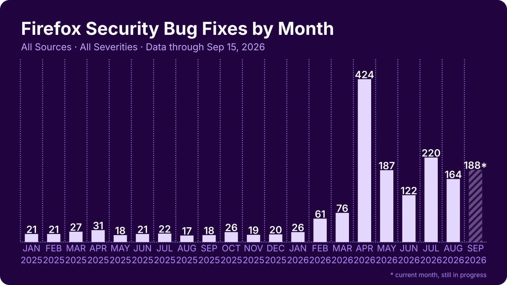
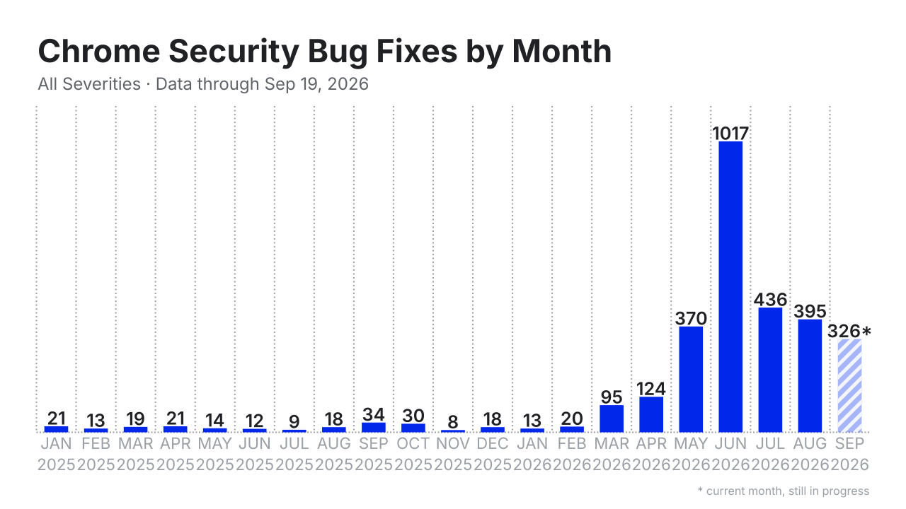
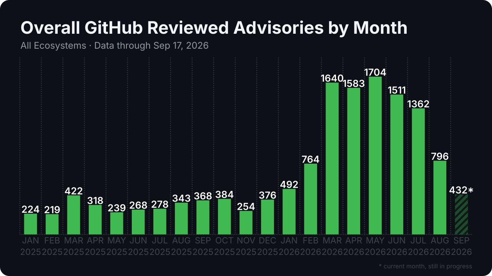
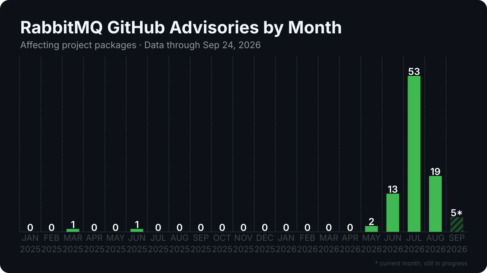

# Security Bug Fix Trackers

Monthly counts of publicly disclosed security fixes — for **Firefox** (Mozilla
MFSA), **Chrome** (Chrome Releases blog), and **GitHub reviewed advisories
(GHSAs)** — plus a generic per-project GitHub advisory tracker. Pure Python
standard library, no dependencies. Charts are SVG; data is TSV.

## Why this tracker

Firefox and Chrome are early adopters of cyber frontier models, and their
public fix streams are the most visible record of what those models do in
practice. Both vendors have documented the shift themselves: Mozilla in
[*Behind the Scenes Hardening Firefox*](https://hacks.mozilla.org/2026/05/behind-the-scenes-hardening-firefox/)
and Google in
[*Stronger with every update*](https://blog.google/security/chrome-stronger-with-every-update/).
Tracking how many security fixes they disclose each month turns that activity
into a measurable signal, helping answer two questions:

- **Is the wave behind us, or still going?** A sustained rise in monthly fixes
  suggests AI-assisted vulnerability discovery is still accelerating; a plateau
  suggests the first wave has passed.
- **Do newer models find bugs that previous ones missed?** When a new frontier
  model is released, Firefox and Chrome will probably get access to it. If fix
  counts climb again beyond what previous models produced, that suggests the
  newer model surfaces vulnerabilities its predecessors did not.

**Caveat:** models *find* vulnerabilities, but these charts only count the
ones that get **fixed**. A continuously high number therefore doesn't
necessarily mean vulnerabilities are still being discovered — it can also mean
these projects simply haven't had enough time to fix everything as fast as the
findings come in. High fix counts can reflect growing discovery *or* a fix
backlog growing faster than the teams can ship; the signal alone can't
separate the two.

**Note on the numbers:** our counts may differ slightly from the vendors' own
articles. Firefox is close but not exact: 424 unique bug IDs in April 2026
here vs. 423 fixes in Mozilla's write-up. Chrome differs by construction:
Google reports fixes per milestone (e.g. "1072 fixed in Chrome 149+150"),
while we bucket them by disclosure month — the common unit that keeps the
series comparable across projects. See [Methodology](#methodology) for the
exact counting rules.

The sections below maintain that record month by month, from public and
verifiable data.

---

## Firefox



Unique Bugzilla bug IDs disclosed in Mozilla Foundation Security Advisories
(desktop Firefox), per announcement month, since January 2025. Roughly 20
fixes/month through 2025, with a single large spike in April 2026 (424) and a
partial September 2026 (113, striped = month still in progress).

Data: [`data/mozilla_mfsa.tsv`](data/mozilla_mfsa.tsv) — `month, total,
critical, high, moderate, low`.

## Chrome



Unique Chromium issue IDs disclosed as security fixes in Chrome Releases
stable-channel desktop posts, per disclosure month. Flat 2025 (8–34/month),
then the AI-era explosion: 95 → 124 → 370 (Mar–May 2026), peaking at **1,017
in June 2026** — more than all of 2025 combined.

Data: [`data/chrome_monthly.tsv`](data/chrome_monthly.tsv) — `month, bug_count`.

## GitHub reviewed advisories (GHSA)



All GitHub-reviewed security advisories (reviewed CVE records in the GitHub
Advisory Database), per publication month. The pace accelerated from ~300/month
in 2025 to 1,500–1,700/month at the spring 2026 peak. Cumulative since
2025-01-01: 13,694 as of 2026-09-05 (snapshot log tracks the running total).

Data: [`data/ghsa_monthly.tsv`](data/ghsa_monthly.tsv) — `month, ghsa`;
[`data/ghsa_counts.tsv`](data/ghsa_counts.tsv) — `snapshot_date, reviewed`.

## Per-project tracking

The GHSA tracker also scopes to any GitHub project: **affecting** = reviewed
package-database advisories matching the project's package names, unioned with
the GHSAs the project itself published (deduplicated by GHSA ID);
**published_by** = the advisories announced on the project's own security page.



RabbitMQ: 95 affecting / 86 published-by as of 2026-09-05, with a large batch
in July 2026.

Data: `data/rabbitmq_ghsa_{counts,monthly}.tsv` — columns
`affecting, published_by` (the `_published_chart.svg` variants chart the
published_by series).

## Methodology

| Tracker | Source | Counting |
|---|---|---|
| Firefox | `mozilla/foundation-security-advisories` git repo | unique Bugzilla bug IDs per announcement month; desktop Firefox (`fixed_in` Firefox / Firefox ESR); severity at max across the bug's CVEs |
| Chrome | Chrome Releases blog (Blogger JSON feed), Stable desktop security posts | unique Chromium issue IDs per post-disclosure month; patch releases of a milestone merge into their months |
| GHSA global | GitHub GraphQL `securityAdvisories` + tokenless scrape of github.com/advisories | reviewed-only dataset by definition; monthly via `publishedSince` boundary deltas; snapshot log for the running total |
| Per project | REST `/advisories?affects=` + repo `/security/advisories` pages | affecting = package-DB results ∪ repo-published GHSAs, deduped by GHSA ID; published_by = repo announcements |

Cross-check anchors: Chrome M151 stable post claims 371 fixes — reproduced
exactly; Google's "1072 fixed in Chrome 149+150" corresponds to 1082 unique
IDs here (Δ ≈ 1%, snapshot scope); GHSA January 2025 = 224 via independent
boundary deltas, and the monthly series sums to the verified cumulative total
13,694.

## Running it yourself

Python 3.10+ (stdlib only). From the repository root:

```bash
# Firefox
python3 scripts/mfsa_table.py \
    --out data/mozilla_mfsa.tsv --chart charts/mozilla_mfsa_chart.svg

# Chrome
python3 scripts/chrome_table.py \
    --out data/chrome_monthly.tsv --chart charts/chrome_monthly_chart.svg

# GitHub reviewed advisories (snapshot works tokenless; the monthly series
# needs a token via GH_TOKEN — no scopes required for public data)
python3 scripts/ghsa_count.py \
    --counts data/ghsa_counts.tsv --monthly data/ghsa_monthly.tsv \
    --chart charts/ghsa_chart.svg

# Per-project (tokenless)
python3 scripts/ghsa_count.py --project rabbitmq \
    --counts data/rabbitmq_ghsa_counts.tsv \
    --monthly data/rabbitmq_ghsa_monthly.tsv \
    --chart charts/rabbitmq_ghsa_chart.svg
```

`--chart-only` regenerates a chart from the existing TSV without network
access; `--as-of YYYY-MM-DD` (Chrome) and `--since` (all trackers) reproduce
historical snapshots. Charts auto-mark the current month/milestone as
incomplete (striped bar + asterisk). Charts regenerate byte-identically from
the same data.

## Updating this repo

Rerun the commands above, then commit the changed files under `data/` and
`charts/`. Only the GHSA global monthly series needs a token; never commit
tokens or keys.
